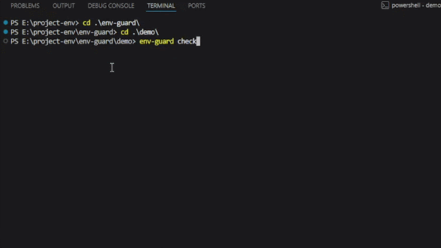

# env-guard 🛡️

[](https://www.npmjs.com/package/env-guard)
[](LICENSE)
[](CONTRIBUTING.md)

`env-guard` is a lightweight, zero-dependency, cross-platform CLI tool and programmatic library designed to prevent developers from accidentally exposing sensitive environment files (`.env`) and hardcoded credentials to Git repositories.

---

## ⚡ Quick Start

Get started instantly without installing globally:

```bash
# Audit your repository for exposed environment files
npx env-guard check

# Scan staged changes for hardcoded secret patterns
npx env-guard scan --staged
```

---

## 🎬 Demo



---

## 💡 Why env-guard?

Accidental secret leakage represents a massive, expensive security vulnerability. Public GitHub repositories are continuously crawled by bots within seconds of a commit.

`env-guard` solves this by introducing dual-layered protection:
1. **Ignorance Audit**: Inspects your project for active environment configurations and checks if they are ignored by `.gitignore` rules (supporting wildcard, directory, and negation configurations).
2. **Credential Scanning**: Scans code files line-by-line using high-fidelity regex patterns to catch hardcoded secrets (AWS, OpenAI, Google APIs, JWT, MongoDB) *before* committing.

---

## ✨ Features

- **🔍 Automatic Env Detection**: Discovers active local environments (`.env`, `.env.local`, `.env.production`, etc.).
- **⚡ Interactive Healing**: Prompts you in the terminal to ignore exposed files on-the-fly, modifying your `.gitignore` safely.
- **🛡️ Staged-Only Scanning (`--staged`)**: Scans *only staged changes* to save time and streamline pre-commit loops.
- **🔒 Secure Screen Protection**: Pre-masks secrets inside findings (e.g. `sk-proj-ab12...9876`) to avoid screen leakage in terminal logs or CI records.
- **🚀 Husky Auto Setup (`--husky`)**: Easily configures pre-commit hooks with single-command setup.
- **💼 CI-Friendly**: Perfect exit code signaling for automation pipelines.

---

## 📦 Installation

To install as a local development dependency:

```bash
npm install env-guard --save-dev
```

To install globally:

```bash
npm install -g env-guard
```

---

## 🚀 CLI Commands

### 1. `env-guard check`
Audits your root directory for `.env` files and checks if they are covered under `.gitignore` rules.
* **Interactive Mode**: If run in TTY (interactive terminal) and an unignored file is found, it will prompt:
  ```text
  ? Would you like to automatically ignore these files? (Y/n)
  ```
  Selecting `Yes` will automatically call the fix mechanism, keeping your repo clean.
* **CI Mode**: If run in non-TTY (or `CI=true`), it skips prompts and exits with code `1` immediately to fail the check.

---

### 2. `env-guard fix`
Safely appends all active, unignored `.env` files directly to `.gitignore`. Creates a new `.gitignore` file if none exists.

---

### 3. `env-guard init`
Configures optimal environment safety defaults:
- Pre-populates `.gitignore` with optimal env rules.
- Builds `.env.example` templates based on your active `.env` configuration, swapping real secrets out for safe placeholders (e.g. `PORT=YOUR_PORT_HERE`).

#### Automated Git Hooks:
Initialize Husky configurations with a single command:
```bash
npx env-guard init --husky
```
This safely creates or appends rules to `.husky/pre-commit` to execute `env-guard check && env-guard scan --staged` before every commit.

---

### 4. `env-guard scan [--staged]`
Scans project files for hardcoded secrets.
- `env-guard scan`: Recursively scans all files in your repository, bypassing binary files, lockfiles, and ignored folders (like `node_modules`).
- `env-guard scan --staged` *(Recommended for pre-commit)*: Diff-filters staged files in Git, scanning **only** the modified files in your staging index. Excellent for large-scale codebases.

---

## ⚙️ CI/CD Integration & Exit Codes

`env-guard` uses clear process exit codes to communicate safety status, making it perfect for Husky, GitHub Actions, and Gitlab pipelines:

| Command | Exit Code `0` (Success) | Exit Code `1` (Failure) |
|---|---|---|
| `check` | All detected `.env` files are ignored. | Unignored `.env` file detected. |
| `scan` | No hardcoded credentials detected. | Exposure detected (sensitive keys exposed in files). |

---

## 🛠️ Programmatic API

You can also integrate `env-guard` directly into custom Node.js build scripts:

```javascript
import { checkCommand, gitignoreService } from 'env-guard';

// Verify ignorance
const clean = await checkCommand(process.cwd());
if (!clean) {
  console.error("Exposed environment files detected!");
}
```

---

## ⚡ Performance

- **Staged Focus**: Staged-only scanning reads only updated files from Git index, meaning scan times remain constant under larger project trees.
- **Tree Elimination**: Crawling paths immediately exits at directories like `node_modules` or `.git`, preventing unnecessary CPU cycles and high-memory usage.

---

## 🔒 False Positives & Disclaimer

- **Disclaimer**: While `env-guard` regular expressions are tuned for high accuracy to capture major vendors, credential scanning is signature-based. This tool does not guarantee 100% detection of all custom secrets.
- **Minimizing False Positives**: We recommend storing long, complex configuration strings inside environment variables, which will keep both your code cleaner and protect against false positives during audits.

---

## 🗺️ Roadmap

- [ ] Add support for custom regex definitions via `.envguardrc.json` configuration file.
- [ ] Add support for custom ignorable secret markers inline (e.g. `// env-guard-disable-line`).
- [ ] Implement parallel file scanning workers for incredibly fast scans in huge projects.
- [ ] Integrate entropy-based credential scanning algorithms.

---

## 📄 License

MIT License. See [LICENSE](LICENSE) for details.
